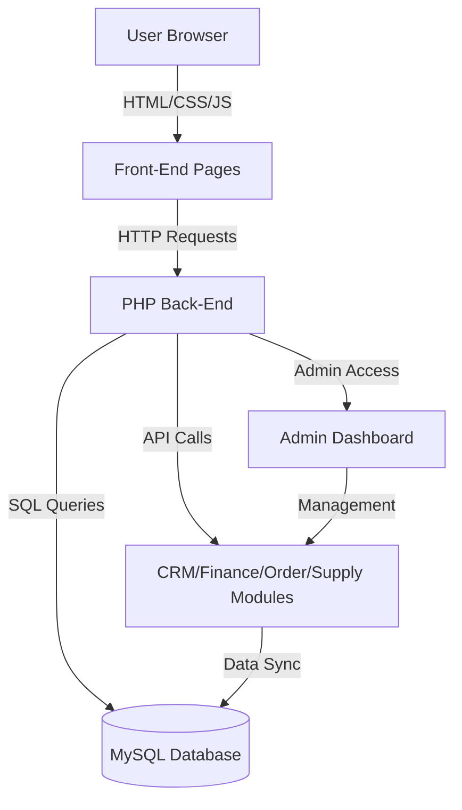

# System Architecture Diagram

```mermaid
graph TD
    A[User Browser] -- HTML/CSS/JS --> B[Front-End Pages]
    B -- HTTP Requests --> C[PHP Back-End]
    C -- SQL Queries --> D[(MySQL Database)]
    C -- Admin Access --> E[Admin Dashboard]
    C -- API Calls --> F[CRM/Finance/Order/Supply Modules]
    F -- Data Sync --> D
    E -- Management --> F
```

*This diagram shows the flow between the user, front-end, back-end, database, and business modules.*