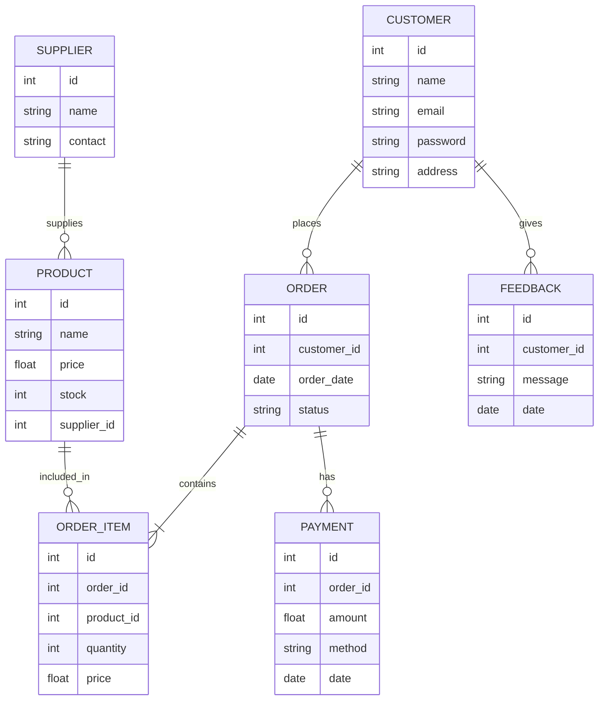

# Database Design

```mermaid
erDiagram
    CUSTOMER ||--o{ ORDER : places
    ORDER ||--|{ ORDER_ITEM : contains
    PRODUCT ||--o{ ORDER_ITEM : included_in
    CUSTOMER ||--o{ FEEDBACK : gives
    SUPPLIER ||--o{ PRODUCT : supplies
    ORDER ||--o{ PAYMENT : has

    CUSTOMER {
        int id
        string name
        string email
        string password
        string address
    }
    PRODUCT {
        int id
        string name
        float price
        int stock
        int supplier_id
    }
    ORDER {
        int id
        int customer_id
        date order_date
        string status
    }
    ORDER_ITEM {
        int id
        int order_id
        int product_id
        int quantity
        float price
    }
    FEEDBACK {
        int id
        int customer_id
        string message
        date date
    }
    SUPPLIER {
        int id
        string name
        string contact
    }
    PAYMENT {
        int id
        int order_id
        float amount
        string method
        date date
    }
```

*This diagram represents the main tables and relationships in the e-business database.*